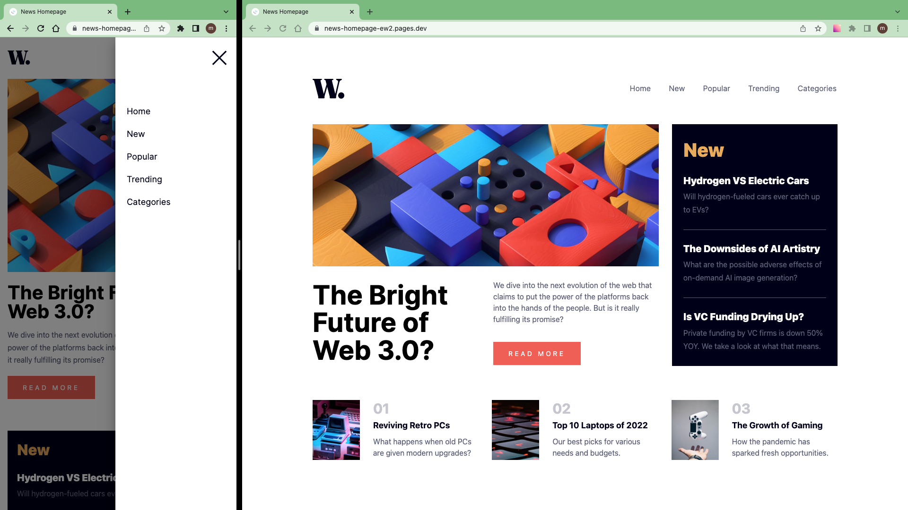

# Frontend Mentor - News homepage solution

This is a solution to the [News homepage challenge on Frontend Mentor](https://www.frontendmentor.io/challenges/news-homepage-H6SWTa1MFl).

## Table of contents

- [Overview](#overview)
  - [The challenge](#the-challenge)
  - [Screenshot](#screenshot)
  - [Links](#links)
- [My process](#my-process)
  - [Work time](#work-time)
  - [Built with](#built-with)
- [Author](#author)
- [Acknowledgments](#acknowledgments)

## Overview

### The challenge

Users should be able to:

- View the optimal layout for the site depending on their device's screen size
- See hover states for all interactive elements on the page

### Screenshot

### Links

- Solution: [frontendmentor.io](https://www.frontendmentor.io/solutions/news-homepage-PaVWpKOmZW)

- Live Site: [cloudflare](https://news-homepage-ew2.pages.dev/)

## My process

- Prepare Project (Download assets, Install Vite, Initialize git, Prepare project)
- Create components
  - 1.Identify a component
  - 2.Code component
  - 3.Style in mobile and desktop
  - 4.Go to step 1
  - Layout, Header, Menu, NewsHomepage, MainNews, LatestNews, NumberedNews

### Work Time

- [My Clockify Report](https://app.clockify.me/shared/647c475994f4c64acaaebdbc)

### Built with

- React
- TailwindCss

## Author

- Frontend Mentor - [@siavhnz](https://www.frontendmentor.io/profile/siavhnz)

- github - [@siavhnz](https://www.github.com/siavhnz)

## Acknowledgments

Thanks To

[Frontendmentor.io](https://www.frontendmentor.io/challenges) - for their Excitement challenges  

[Perfect Pixel](https://chrome.google.com/webstore/detail/perfectpixel-by-welldonec/dkaagdgjmgdmbnecmcefdhjekcoceebi?hl=en) - for such a great extension